# cl-llm-provider API Specification

Formal protocol contracts, type specifications, and implementation requirements.

## Protocol Method Contracts

### Generic Function: `send-completion-request`

**Signature**:
```lisp
(send-completion-request provider messages &key model max-tokens
                                               temperature system tools
                                               tool-choice stop)
→ hash-table
```

**Parameters**:

| Parameter | Type | Constraint | Default |
|-----------|------|------------|---------|
| `provider` | `llm-provider` | MUST be initialized instance | required |
| `messages` | `list` | List of message plists, ≥1 element | required |
| `model` | `string` | Provider-specific model ID | required |
| `max-tokens` | `(integer 1 *)` | Positive integer, provider-specific max | provider default |
| `temperature` | `(real 0 2)` | 0.0 ≤ temp ≤ 2.0 | provider default (usually 1.0) |
| `system` | `(or string null)` | System prompt | `nil` |
| `tools` | `(or list null)` | List of `tool-definition` | `nil` |
| `tool-choice` | `(or keyword string null)` | `:auto`, `:none`, tool name | `nil` |
| `stop` | `(or string list null)` | Stop sequence(s) | `nil` |

**Returns**: `hash-table` (JSON-parsed provider response)

**Side Effects**:
- HTTP POST request to provider API
- Updates `*performance-stats*` if `*performance-profiling*` enabled

**Signals**:
- `provider-api-error` - HTTP error (4xx, 5xx)
- `provider-rate-limit-error` - 429 response
- `provider-authentication-error` - 401 response

**Protocol Contract**:
```
PRECONDITIONS:
  (typep provider 'llm-provider)
  (provider-base-url provider) ≠ nil
  (every #'message-valid-p messages)
  (> (length messages) 0)
  (or (null tools) (every (lambda (t) (typep t 'tool-definition)) tools))

POSTCONDITIONS:
  (hash-table-p RESULT)
  (gethash "choices" RESULT) ∨ (gethash "content" RESULT)  ; Provider-specific structure

INVARIANTS PRESERVED:
  *performance-stats* keys ∈ {:encode-time, :api-time, :decode-time}
```

**Implementation Requirements**:
1. MUST use `with-performance-timing` around encode, HTTP, decode phases
2. MUST call `handle-http-error` on non-2xx status
3. MUST preserve raw HTTP response body in return value
4. SHOULD use `plist-to-hash` for message conversion
5. MUST translate `tool-definition` objects via `translate-tool-to-provider`

---

### Generic Function: `parse-completion-response`

**Signature**:
```lisp
(parse-completion-response provider raw-response &key performance)
→ completion-response
```

**Parameters**:

| Parameter | Type | Constraint |
|-----------|------|------------|
| `provider` | `llm-provider` | Must match provider that generated raw-response |
| `raw-response` | `hash-table` | Output from `send-completion-request` |
| `performance` | `(or list null)` | Performance plist or nil |

**Returns**: `completion-response` instance

**Protocol Contract**:
```
PRECONDITIONS:
  (hash-table-p raw-response)

POSTCONDITIONS:
  (typep RESULT 'completion-response)
  (response-raw RESULT) ≡ raw-response  ; Exact identity preserved
  (member (response-finish-reason RESULT) '(:stop :length :tool-calls :content-filter))
  (typep (response-usage RESULT) 'list)
  (every #'integerp (list (getf (response-usage RESULT) :prompt-tokens)
                          (getf (response-usage RESULT) :completion-tokens)
                          (getf (response-usage RESULT) :total-tokens)))

INVARIANTS PRESERVED:
  Token counts non-negative (INV-002)
  Tool call IDs unique (INV-003)
  Raw response preserved (INV-001)
```

**Implementation Requirements**:
1. MUST normalize finish reason to keyword (`:stop`, `:length`, `:tool-calls`, `:content-filter`)
2. MUST extract token usage into plist format
3. MUST preserve raw-response exactly (no deep copy, no modification)
4. MUST populate `:message` slot for conversation continuation
5. SHOULD extract provider-specific metadata into `:metadata` plist
6. Tool calls: MUST use `parse-tool-calls` or equivalent provider-specific parsing

---

### Generic Function: `translate-tool-to-provider`

**Signature**:
```lisp
(translate-tool-to-provider provider tool-definition)
→ hash-table
```

**Parameters**:

| Parameter | Type | Constraint |
|-----------|------|------------|
| `provider` | `llm-provider` | Provider requiring translation |
| `tool-definition` | `tool-definition` | Validated tool definition |

**Returns**: `hash-table` (provider-specific tool schema)

**Protocol Contract**:
```
PRECONDITIONS:
  (typep tool-definition 'tool-definition)
  (tool-name tool-definition) matches ^[a-zA-Z0-9_-]+$
  (every (lambda (p) (member (getf p :type)
                             '(:string :integer :number :boolean :array :object)))
         (tool-parameters tool-definition))

POSTCONDITIONS:
  (hash-table-p RESULT)
  ; OpenAI format:
  (gethash "type" RESULT) = "function" ∧
  (hash-table-p (gethash "function" RESULT))
  ; OR Anthropic format:
  (stringp (gethash "name" RESULT)) ∧
  (hash-table-p (gethash "input_schema" RESULT))
```

**Provider-Specific Formats**:

**OpenAI**:
```json
{
  "type": "function",
  "function": {
    "name": "tool_name",
    "description": "Tool description",
    "parameters": {
      "type": "object",
      "properties": {
        "param_name": {
          "type": "string",
          "description": "Param description",
          "enum": ["val1", "val2"]
        }
      },
      "required": ["param_name"]
    }
  }
}
```

**Anthropic**:
```json
{
  "name": "tool_name",
  "description": "Tool description",
  "input_schema": {
    "type": "object",
    "properties": {
      "param_name": {
        "type": "string",
        "description": "Param description",
        "enum": ["val1", "val2"]
      }
    },
    "required": ["param_name"]
  }
}
```

**Type Mapping** (CL keyword → JSON Schema):

| CL Type | JSON Schema Type |
|---------|------------------|
| `:string` | `"string"` |
| `:integer` | `"integer"` |
| `:number` | `"number"` |
| `:boolean` | `"boolean"` |
| `:array` | `"array"` |
| `:object` | `"object"` |

---

### Generic Function: `parse-tool-calls`

**Signature**:
```lisp
(parse-tool-calls provider raw-response)
→ (or list null)
```

**Parameters**:

| Parameter | Type | Constraint |
|-----------|------|------------|
| `provider` | `llm-provider` | Provider that generated response |
| `raw-response` | `hash-table` | Provider response |

**Returns**: List of `tool-call` instances or `nil`

**Protocol Contract**:
```
POSTCONDITIONS:
  (or (null RESULT)
      (and (listp RESULT)
           (every (lambda (c) (typep c 'tool-call)) RESULT)))
  ; Tool call ID uniqueness (INV-003)
  (= (length RESULT)
     (length (remove-duplicates RESULT :key #'tool-call-id :test #'string=)))
```

---

## Type Specifications

### Class: `llm-provider`

**Slots**:

| Slot | Type | Accessor | Initarg | Required |
|------|------|----------|---------|----------|
| `api-key` | `(or string null)` | `provider-api-key` | `:api-key` | No (env fallback) |
| `base-url` | `(or string null)` | `provider-base-url` | `:base-url` | No (default) |
| `default-model` | `(or string null)` | `provider-default-model` | `:model` | No |
| `options` | `list` | `provider-options` | `:options` | No |

**Subclasses**: `anthropic-provider`, `openai-provider`, `ollama-provider`, `openrouter-provider`, `openai-compatible-provider`

**Invariant**: `∀ provider ∈ {anthropic, openai, openrouter, openai-compatible}: (provider-api-key provider) ≠ nil before API call`

---

### Class: `completion-response`

**Slots**:

| Slot | Type | Accessor | Description |
|------|------|----------|-------------|
| `id` | `string` | `response-id` | Unique response identifier |
| `model` | `string` | `response-model` | Model that generated response |
| `content` | `(or string null)` | `response-content` | Text content (nil if tool-calls) |
| `message` | `list` | `response-message` | Message plist for continuation |
| `tool-calls` | `(or list null)` | `response-tool-calls` | List of `tool-call` instances |
| `finish-reason` | `keyword` | `response-finish-reason` | `:stop`, `:length`, `:tool-calls`, `:content-filter` |
| `usage` | `list` | `response-usage` | Token usage plist |
| `raw` | `hash-table` | `response-raw` | Original provider response |
| `performance` | `(or list null)` | `response-performance` | Timing plist |
| `metadata` | `(or list null)` | `response-metadata` | Provider-specific metadata |

**Usage Plist Schema**:
```lisp
(:prompt-tokens INTEGER≥0
 :completion-tokens INTEGER≥0
 :total-tokens INTEGER≥0)
```

**Performance Plist Schema** (when `*performance-profiling*` enabled):
```lisp
(:encode-time REAL≥0  ; JSON encoding time
 :api-time REAL≥0     ; HTTP request/response time
 :decode-time REAL≥0) ; JSON parsing time
```

**Message Plist Schema**:
```lisp
;; Text response
(:role "assistant" :content STRING)

;; Tool call response
(:role "assistant" :tool-calls LIST-OF-TOOL-CALLS)
```

---

### Class: `tool-definition`

**Slots**:

| Slot | Type | Accessor | Initarg | Required |
|------|------|----------|---------|----------|
| `name` | `string` | `tool-name` | `:name` | Yes |
| `description` | `string` | `tool-description` | `:description` | Yes |
| `parameters` | `list` | `tool-parameters` | `:parameters` | Yes |
| `required` | `list` | `tool-required-params` | `:required` | No |
| `safety-level` | `keyword` | `tool-safety-level` | `:safety-level` | No (`:safe`) |
| `categories` | `list` | `tool-categories` | `:categories` | No |
| `requires-approval` | `(or boolean keyword)` | `tool-requires-approval` | `:requires-approval` | No (`nil`) |
| `parameter-validators` | `list` | `tool-parameter-validators` | `:parameter-validators` | No |
| `on-start` | `(or function null)` | `tool-on-start` | `:on-start` | No |
| `on-complete` | `(or function null)` | `tool-on-complete` | `:on-complete` | No |
| `on-error` | `(or function null)` | `tool-on-error` | `:on-error` | No |
| `handler` | `(or function null)` | `tool-handler` | `:handler` | No |
| `metadata` | `list` | `tool-metadata` | `:metadata` | No |

**Parameter Plist Schema**:
```lisp
(:name STRING           ; Parameter name
 :type KEYWORD          ; :string | :integer | :number | :boolean | :array | :object
 :description STRING    ; Parameter description
 :enum LIST)            ; Optional: list of allowed values
```

**Name Constraint**: `^[a-zA-Z0-9_-]+$`

**Safety Level Vocabulary**: `:safe`, `:moderate`, `:dangerous`

**Requires Approval Vocabulary**: `nil`, `t`, `:always`, `:if-dangerous`

---

### Class: `tool-call`

**Slots**:

| Slot | Type | Accessor | Description |
|------|------|----------|-------------|
| `id` | `string` | `tool-call-id` | Unique call identifier |
| `name` | `string` | `tool-call-name` | Tool name to invoke |
| `arguments` | `list` | `tool-call-arguments` | Plist of arguments |

**Arguments Plist**: Keys are keyword versions of parameter names, values are JSON-parsed types

**Example**:
```lisp
;; JSON: {"location": "Paris", "unit": "celsius"}
;; Plist: (:|location| "Paris" :|unit| "celsius")
```

---

## Message Format Specifications

### Message Types

#### User Message
```lisp
(:role "user" :content STRING)
```

**Constraints**:
- `:content` MUST be non-empty string
- `:role` MUST be exactly `"user"` (lowercase string)

#### Assistant Message (Text)
```lisp
(:role "assistant" :content STRING)
```

**Constraints**:
- `:content` MUST be non-empty string
- `:role` MUST be exactly `"assistant"`

#### Assistant Message (Tool Calls)
```lisp
(:role "assistant" :tool-calls LIST-OF-TOOL-CALL-PLISTS)
```

**Tool Call Plist**:
```lisp
(:|id| STRING
 :|name| STRING
 :|arguments| HASH-TABLE-OR-PLIST)
```

**Constraints**:
- `:tool-calls` MUST be non-empty list
- Each tool call MUST have unique `:|id|`
- `:content` typically nil (provider-specific)

#### System Message
```lisp
(:role "system" :content STRING)
```

**Constraints**:
- `:content` MUST be non-empty string
- SHOULD appear at start of message list
- Some providers (Anthropic) handle via separate `:system` parameter

#### Tool Result Message
```lisp
(:role "tool"
 :tool-call-id STRING
 :content STRING
 :is-error BOOLEAN)
```

**Constraints**:
- `:tool-call-id` MUST match `tool-call-id` from previous assistant message
- `:content` MUST be present (empty string allowed for void results)
- `:is-error` optional, defaults to `nil`

### Message Ordering Rules

```
Valid orderings (regex-like notation):

system? (user assistant+)* user?

Explanation:
- Optional system message at start
- Alternating user/assistant turns
- Assistant may generate multiple messages in sequence (tool-call → tool-result → final)
- Last message typically user (for completion request)
```

**Invalid orderings**:
```lisp
;; Two consecutive user messages
((:role "user" :content "A")
 (:role "user" :content "B"))  ; ❌ Invalid

;; Tool result before tool call
((:role "tool" :tool-call-id "123" :content "result")
 (:role "assistant" :tool-calls ...))  ; ❌ Invalid - wrong order
```

---

## Condition Hierarchy

```
condition
└── error
    └── llm-provider-error
        ├── provider-configuration-error
        ├── provider-api-error
        │   ├── provider-rate-limit-error
        │   └── provider-authentication-error
        ├── tool-schema-error
        ├── tool-validation-error
        ├── tool-approval-error
        ├── tool-approval-required
        └── tool-safety-violation
```

### Condition Slots

**`llm-provider-error`**:
- `provider` - Provider instance that signaled error
- `message` - Human-readable error message

**`provider-configuration-error`**:
- Inherits: `llm-provider-error`
- Additional: `missing-key` - Name of missing configuration key

**`provider-api-error`**:
- Inherits: `llm-provider-error`
- Additional:
  - `status-code` - HTTP status code (integer)
  - `body` - Response body (string or hash-table)

**`provider-rate-limit-error`**:
- Inherits: `provider-api-error`
- Additional: `retry-after` - Seconds to wait (integer or nil)

**`tool-validation-error`**:
- Inherits: `llm-provider-error`
- Additional:
  - `tool` - Tool definition
  - `parameter` - Parameter name that failed
  - `value` - Value that failed validation
  - `validator` - Validator spec
  - `reason` - Failure reason

### Restart Contracts

**`wait-and-retry`** (provided by `provider-rate-limit-error`):
- Available when: Rate limit error signaled
- Action: Sleeps for `retry-after` seconds, then retries request
- Returns: Result of retry
- Contract: `(sleep (error-retry-after condition))` before retry

**`retry`** (provided by `provider-rate-limit-error`, `provider-api-error`):
- Available when: API error signaled
- Action: Immediately retries request without delay
- Returns: Result of retry
- Contract: No delay, direct retry

**`use-value`** (provided by `provider-authentication-error`):
- Available when: Authentication error signaled
- Action: Accepts new API key, updates provider, retries
- Argument: New API key (string)
- Returns: Result of retry with new key
- Contract: `(setf (slot-value provider 'api-key) new-key)`

**`use-fallback-provider`** (established by `complete` / `complete-stream` / `embedding`):
- Available when: any error is signaled during a request — network, API, or model
- Action: Re-issues the request against a different provider
- Arguments: `(fallback &optional fallback-model)`
  - `fallback` — a provider instance or a provider-type keyword
  - `fallback-model` — **supply this whenever the fallback is a different service.**
    Omitted, the caller's original model is kept and re-resolved against the new
    provider, which is correct only when both endpoints serve the *same* model
    (two mirrors, a local copy of a cloud model). Across services it sends a name
    the fallback has never heard of and the request dies on the fallback's own 404
    — `"gemma-4-26B-A4B-it-QAT-MLX-4bit"` means nothing to OpenRouter.
- Returns: Result from the fallback
- Contract: sets both the provider and the model used by the next attempt

```lisp
;; Local-first with a cloud understudy. BOTH arguments, because the two
;; services do not share a model name.
(handler-bind
    ((provider-network-error
       (lambda (c)
         (let ((r (find-restart 'use-fallback-provider c)))
           (when r (invoke-restart r cloud-provider "openai/gpt-oss-120b"))))))
  (complete messages :provider local-provider :model "gemma-4-26B-A4B-it-QAT-MLX-4bit"))
```

**`use-model`** (established by `complete` / `complete-stream` / `embedding`):
- Available when: any error is signaled during a request; the one it is for is
  `provider-model-not-found-error`
- Action: Re-issues the request against the **same** provider with a different model
- Argument: Model name (string). `NIL` means "use the provider's own default".
- Returns: Result of the retry
- Contract: sets the model used by the next attempt, provider unchanged. The
  correction also SURVIVES a later one-argument `use-fallback-provider` — both
  restarts write the same model, so failing over after a correction carries the
  corrected name, not the one you started with.
- Use this rather than `use-fallback-provider` when the model name is the only
  thing wrong. Changing provider to fix a typo is a sledgehammer, and `retry`
  repeats the same 404.

### Macro: `with-auto-recovery`

Declarative retries plus failover, for callers who do not want to write a handler.

**Signature**:
```lisp
(with-auto-recovery (&key max-retries backoff-base fallback-providers on-retry)
  &body body)
```

**Parameters**:
- `max-retries` — integer, default 3. Retries on transient errors only
  (`transient-error-p`).
- `backoff-base` — real, default 1.0. Exponential backoff multiplier in seconds.
- `fallback-providers` — list of entries tried after retries are exhausted. Each
  entry is a provider, or `(provider . model)` / `(provider model)`.
  **Name the model whenever the fallback is a different service**, for the same
  reason as `use-fallback-provider`: a bare entry keeps the caller's model.
- `on-retry` — `(lambda (condition attempt) ...)`, called with `attempt` 0 on a
  fallback switch.

**Contract**:
- Retries RE-EXECUTE `body`. The fallback switch DOES NOT — it invokes the
  `use-fallback-provider` restart, so only the failing request is re-issued and
  side effects earlier in `body` are not repeated.
- Because it uses the restart, it reaches a `body` that passes `:provider`
  explicitly. A `*default-provider*` rebinding could not.
- For a `body` with no LLM call in scope — one that signals an
  `llm-provider-error` itself — there is no restart to invoke, and the macro
  rebinds `*default-provider*` and re-executes `body` instead.

```lisp
(with-auto-recovery (:max-retries 3
                     :fallback-providers (list (cons cloud-provider "openai/gpt-oss-120b")))
  (complete messages :provider local-provider :model "gemma-4-26B-A4B-it-QAT-MLX-4bit"))
```

**Do not nest** inside another `handler-bind` that handles `llm-provider-error` —
the outer handler fires first and may re-execute the body before inner handlers
run. Use it as the outermost recovery layer.

---

## Performance Profiling Specification

### Dynamic Variables

**`*performance-profiling*`**:
- Type: `boolean`
- Default: `nil`
- Effect: When non-nil, enables timing collection
- Scope: Dynamic (use `let` binding to scope)

**`*performance-stats*`**:
- Type: `list` (plist)
- Default: `nil`
- Effect: Holds timing data during request
- Structure: `(:encode-time REAL :api-time REAL :decode-time REAL)`
- Scope: Dynamically bound by `complete` and `embedding`
- Contract: MUST NOT be modified except via `with-performance-timing`

### Macro: `with-performance-timing`

**Signature**:
```lisp
(with-performance-timing (stat-key) &body body)
```

**Parameters**:
- `stat-key` - Keyword: `:encode-time`, `:api-time`, or `:decode-time`
- `body` - Forms to execute

**Returns**: Multiple values from body (preserves multiple-value-prog1)

**Side Effects**: Updates `(getf *performance-stats* stat-key)` with elapsed seconds

**Contract**:
```
IF *performance-profiling* = T:
  LET start-time = (get-monotonic-time)
  EXECUTE body
  LET elapsed = (- (get-monotonic-time) start-time)
  (setf (getf *performance-stats* stat-key) elapsed)
ELSE:
  EXECUTE body (no timing)
```

**Usage Pattern** (from protocol methods):
```lisp
(with-performance-timing (:encode-time)
  (yason:encode request-body stream))

(with-performance-timing (:api-time)
  (dex:post url :headers headers :content body))

(with-performance-timing (:decode-time)
  (yason:parse response-string))
```

---

## Configuration Specification

### Environment Variables

| Variable | Provider | Required | Format |
|----------|----------|----------|--------|
| `ANTHROPIC_API_KEY` | Anthropic | Yes | `sk-ant-...` |
| `OPENAI_API_KEY` | OpenAI | Yes | `sk-...` |
| `OPENROUTER_API_KEY` | OpenRouter | Yes | `sk-or-...` |

**Ollama**: No API key required (local)

### Global Variables

**`*default-provider*`**:
- Type: `(or llm-provider null)`
- Default: `nil`
- Usage: Fallback when `:provider` not specified in `complete` or `embedding`

**`*default-model*`**:
- Type: `(or string null)`
- Default: `nil`
- Usage: Fallback when `:model` not specified and provider has no default

**`*default-temperature*`**:
- Type: `(or real null)`
- Default: `nil`
- Constraint: `0.0 ≤ temperature ≤ 2.0`
- Usage: Fallback when `:temperature` not specified

**`*default-max-tokens*`**:
- Type: `(or (integer 1 *) null)`
- Default: `nil`
- Usage: Fallback when `:max-tokens` not specified

### Configuration File

**Path**: `~/.config/cl-llm-provider/config.lisp` (XDG-compliant)

**Format**: Common Lisp source file (loaded via `load`)

**Capabilities**:
- Set environment variables: `(setf (uiop:getenv "KEY") "value")`
- Set global defaults: `(setf *default-provider* ...)`
- Conditional logic: Full Lisp evaluation

**Security**:
- MUST be user-readable only (`chmod 600`)
- MUST NOT be committed to version control
- Agent MUST NOT write API keys to config file automatically

**Example**:
```lisp
;; ~/.config/cl-llm-provider/config.lisp
(setf (uiop:getenv "ANTHROPIC_API_KEY") "sk-ant-...")
(setf cl-llm-provider:*default-provider*
      (cl-llm-provider:make-provider :anthropic
                                      :model "claude-3-5-sonnet-20241022"))
```

---

## Provider-Specific Behavior

### Anthropic

**Base URL**: `https://api.anthropic.com/v1`

**Required Headers**:
- `anthropic-version: 2023-06-01`
- `Authorization: Bearer {api-key}`
- `Content-Type: application/json`

**System Prompt**: Separate `system` parameter (not in messages array)

**Tool Format**: Anthropic-specific (see `translate-tool-to-provider`)

**Tool Calls**: In `content` array as `type: "tool_use"` blocks

**Finish Reason Mapping**:
- `"end_turn"` → `:stop`
- `"max_tokens"` → `:length`
- `"tool_use"` → `:tool-calls`

**Token Usage**: `input_tokens`, `output_tokens` (no `total_tokens` field)

**Embeddings**: Not supported - signals `provider-api-error`

---

### OpenAI

**Base URL**: `https://api.openai.com/v1`

**Required Headers**:
- `Authorization: Bearer {api-key}`
- `Content-Type: application/json`

**System Prompt**: Message with `role: "system"` in messages array

**Tool Format**: OpenAI function calling format

**Tool Calls**: In `message.tool_calls` array

**Finish Reason Mapping**:
- `"stop"` → `:stop`
- `"length"` → `:length`
- `"tool_calls"` → `:tool-calls`
- `"content_filter"` → `:content-filter`

**Token Usage**: `prompt_tokens`, `completion_tokens`, `total_tokens`

**Embeddings**: Supported via `/embeddings` endpoint

---

### Ollama

**Base URL**: `http://localhost:11434` (default)

**API Key**: Not required

**API Format**: OpenAI-compatible (uses `/v1/chat/completions`)

**Tool Support**: Via OpenAI-compatible format

**Embeddings**: Supported via `/api/embeddings` (Ollama-specific endpoint)

---

### OpenRouter

**Base URL**: `https://openrouter.ai/api/v1`

**Format**: OpenAI-compatible

**Model Names**: `provider/model` format (e.g., `anthropic/claude-3-opus`)

**Special**: Supports multiple underlying providers

---

## JSON Schema Type Mappings

### Parameter Type Mapping

| CL Keyword | JSON Schema | JSON Value Type | Example |
|------------|-------------|-----------------|---------|
| `:string` | `"string"` | String | `"Paris"` |
| `:integer` | `"integer"` | Number (int) | `42` |
| `:number` | `"number"` | Number (float) | `3.14` |
| `:boolean` | `"boolean"` | Boolean | `true` |
| `:array` | `"array"` | Array | `[1, 2, 3]` |
| `:object` | `"object"` | Object | `{"key": "value"}` |

### Argument Parsing

**From JSON** (provider response):
```json
{"location": "Paris", "unit": "celsius", "count": 5}
```

**To Plist** (CL):
```lisp
(:|location| "Paris" :|unit| "celsius" :|count| 5)
```

**Key Conversion**: JSON string keys → keyword symbols with `:|name|` syntax

**Access**:
```lisp
(getf args :|location|)  ; => "Paris"
```

---

## Validation Rules

### Tool Name Validation

**Pattern**: `^[a-zA-Z0-9_-]+$`

**Valid**: `get_weather`, `search-documents`, `calculate123`

**Invalid**: `get weather` (space), `get.weather` (period), `get/weather` (slash)

**Rationale**: OpenAI rejects invalid patterns, Anthropic more permissive but consistency preferred

---

### Message Validation

```lisp
(defun message-valid-p (message)
  "Check if message satisfies RULE-002, RULE-013."
  (and (listp message)
       (member (getf message :role) '("user" "assistant" "system" "tool") :test #'string=)
       (or (and (stringp (getf message :content))
                (> (length (getf message :content)) 0))
           (getf message :tool-calls)
           (getf message :tool-call-id))))
```

---

### Tool Parameter Validation

```lisp
(defun parameter-valid-p (parameter)
  "Check if parameter spec satisfies RULE-011."
  (and (listp parameter)
       (stringp (getf parameter :name))
       (member (getf parameter :type)
               '(:string :integer :number :boolean :array :object))
       (stringp (getf parameter :description))))
```

---

## Implementation Checklist for New Providers

```
[ ] Subclass llm-provider
[ ] Implement provider-default-base-url method
[ ] Implement provider-api-key-env-var method
[ ] Implement send-completion-request method
    [ ] Use with-performance-timing for encode/api/decode
    [ ] Handle HTTP errors via handle-http-error
    [ ] Build provider-specific request format
[ ] Implement parse-completion-response method
    [ ] Normalize finish-reason to keyword
    [ ] Extract token usage to standard plist format
    [ ] Preserve raw response exactly
    [ ] Build message plist for continuation
    [ ] Extract metadata into :metadata plist
[ ] Implement translate-tool-to-provider method (if tools supported)
[ ] Implement parse-tool-calls method (if tools supported)
[ ] Implement send-embedding-request method (if embeddings supported)
[ ] Implement parse-embedding-response method (if embeddings supported)
[ ] Add provider class to make-provider ecase
[ ] Test against RULE-001 through RULE-015
[ ] Test against INV-001 through INV-007
[ ] Document provider-specific behavior
```

---

## State Machine: Completion Request Flow

```dot
digraph completion_flow {
    rankdir=LR
    node [shape=box]

    start [shape=ellipse label="complete called"]
    validate [label="Validate\nprovider,\nmodel,\nmessages"]
    encode [label="Encode request\n(with-performance-timing)"]
    http [label="HTTP POST\n(with-performance-timing)"]
    check_status [shape=diamond label="2xx\nstatus?"]
    decode [label="Parse response\n(with-performance-timing)"]
    parse [label="Parse to\ncompletion-response"]
    success [shape=ellipse label="Return response"]
    error [shape=ellipse label="Signal condition"]

    start -> validate
    validate -> encode
    encode -> http
    http -> check_status
    check_status -> decode [label="yes"]
    check_status -> error [label="no"]
    decode -> parse
    parse -> success
}
```



---

## Summary Statistics

| Category | Count |
|----------|-------|
| Protocol methods | 6 |
| Classes | 5 |
| Conditions | 9 |
| Restarts | 4 |
| Global variables | 5 |
| Dynamic variables | 2 |
| Message types | 5 |
| Provider implementations | 5 |
| Rules referenced | 15 |
| Invariants referenced | 7 |
