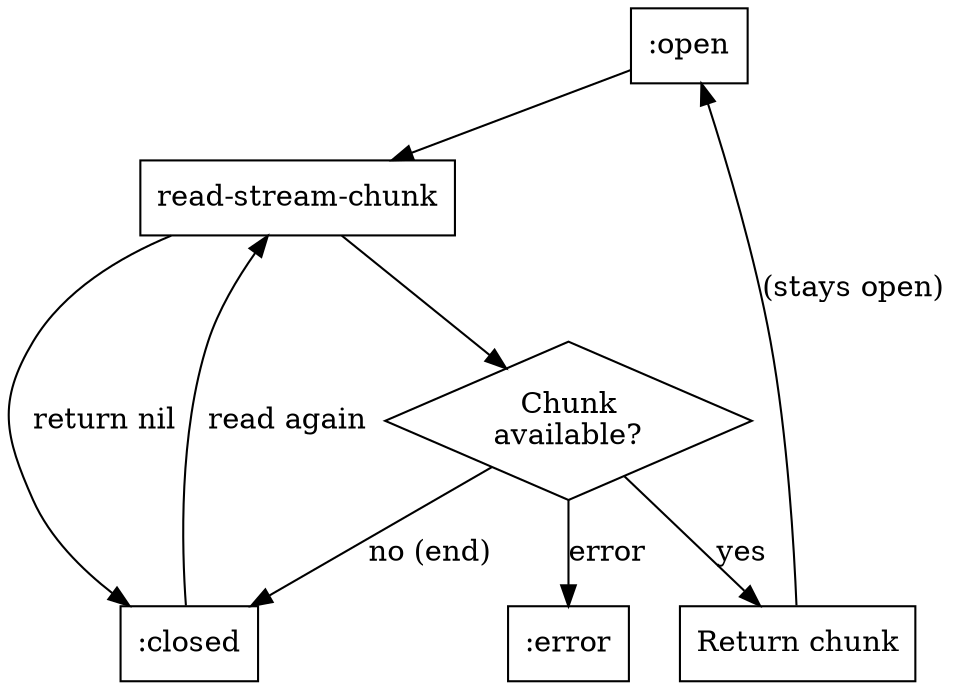

# Phase 1 API Specification

Formal protocol contracts for streaming, token counting, cost estimation, and observability. Append these to API-SPEC.agent.md.

---

## Streaming API

### Function: `complete-stream`

**Signature**:
```lisp
(complete-stream messages &key provider model max-tokens temperature
                              system tools tool-choice stop
                              on-chunk on-complete on-error hooks)
→ completion-stream
```

**Parameters**:

| Parameter | Type | Constraint | Default |
|-----------|------|------------|---------|
| `messages` | `list` | List of message plists, ≥1 element | required |
| `provider` | `(or llm-provider null)` | Initialized provider instance | `*default-provider*` |
| `model` | `(or string null)` | Provider-specific model ID | provider default |
| `max-tokens` | `(or (integer 1 *) null)` | Positive integer | provider default |
| `temperature` | `(or (real 0 2) null)` | 0.0 ≤ temp ≤ 2.0 | provider default |
| `system` | `(or string null)` | System prompt | `nil` |
| `tools` | `(or list null)` | List of tool-definition | `nil` |
| `tool-choice` | `(or keyword string null)` | `:auto`, `:none`, tool name | `nil` |
| `stop` | `(or string list null)` | Stop sequence(s) | `nil` |
| `on-chunk` | `(or function null)` | `(lambda (chunk) ...)` | `nil` |
| `on-complete` | `(or function null)` | `(lambda (full-content final-chunk) ...)` | `nil` |
| `on-error` | `(or function null)` | `(lambda (error) ...)` | `nil` |
| `hooks` | `(or hooks null)` | Observability hooks | `*global-hooks*` |

**Returns**: `completion-stream` instance

**Side Effects**:
- HTTP POST request to provider API with `stream: true`
- If callbacks provided, invokes them during streaming
- Hooks invoked if non-nil

**Signals**:
- `provider-api-error` - HTTP error (4xx, 5xx)
- `stream-error` - Stream parsing error

**Protocol Contract**:
```
PRECONDITIONS:
  (> (length messages) 0)
  (or (null provider) (typep provider 'llm-provider))
  (or (null on-chunk) (functionp on-chunk))
  (or (null on-complete) (functionp on-complete))
  (or (null on-error) (functionp on-error))

POSTCONDITIONS:
  (typep RESULT 'completion-stream)
  (member (stream-state RESULT) '(:open :closed :error))
  (eq (stream-provider RESULT) provider)

INVARIANTS:
  INV-STREAM-001: (string= (stream-accumulated-content RESULT)
                           (apply #'concatenate 'string
                                  (mapcar #'chunk-delta (stream-chunks RESULT))))
  INV-STREAM-002: (= (length (stream-chunks RESULT))
                    (loop for i from 0 for chunk in (stream-chunks RESULT)
                          always (= (chunk-index chunk) i)))
```

**Callback Invocation Order**:

```dot
digraph callback_order {
    rankdir=LR
    node [shape=box]

    start [shape=ellipse label="complete-stream called"]
    http [label="HTTP request started"]
    chunk1 [label="Chunk 1 received"]
    on_chunk1 [label="on-chunk(chunk1)"]
    chunk2 [label="Chunk 2 received"]
    on_chunk2 [label="on-chunk(chunk2)"]
    done [label="Stream exhausted"]
    on_complete [label="on-complete(content, final)"]
    ret [shape=ellipse label="Return stream"]

    start -> http
    http -> chunk1
    chunk1 -> on_chunk1
    on_chunk1 -> chunk2
    chunk2 -> on_chunk2
    on_chunk2 -> done [label="..."]
    done -> on_complete
    on_complete -> ret

    error [label="Error occurred" shape=diamond]
    on_error [label="on-error(error)" shape=box]
    http -> error [style=dotted label="if error"]
    error -> on_error
    on_error -> ret [label="propagate"]
}
```


---

### Function: `read-stream-chunk`

**Signature**:
```lisp
(read-stream-chunk stream &key timeout)
→ (or stream-chunk null)
```

**Parameters**:

| Parameter | Type | Constraint | Default |
|-----------|------|------------|---------|
| `stream` | `completion-stream` | Must be in `:open` state | required |
| `timeout` | `(or real null)` | Seconds to wait, nil = infinite | `nil` |

**Returns**: `stream-chunk` instance, or `nil` if stream exhausted

**Blocking Behavior**: Blocks until chunk available or timeout

**Side Effects**:
- Reads from HTTP stream
- Updates `(stream-chunks stream)` with new chunk
- Updates `(stream-accumulated-content stream)`
- May transition `(stream-state stream)` to `:closed` or `:error`

**Signals**:
- `timeout-error` - Timeout exceeded
- `stream-error` - Read error

**Protocol Contract**:
```
PRECONDITIONS:
  (typep stream 'completion-stream)
  (or (eq (stream-state stream) :open)
      (eq (stream-state stream) :closed))  ; Allowed after close (returns nil)

POSTCONDITIONS:
  CASE 1 (chunk available):
    (typep RESULT 'stream-chunk)
    (string= (chunk-content RESULT) (stream-accumulated-content stream))

  CASE 2 (stream exhausted):
    (null RESULT)
    (eq (stream-state stream) :closed)

INVARIANTS:
  INV-STREAM-003: After read-stream-chunk returns nil once,
                  all subsequent calls return nil (idempotent)
```

**State Machine**:


---

### Class: `stream-chunk`

**Slots**:

| Slot | Type | Accessor | Description |
|------|------|----------|-------------|
| `content` | `string` | `chunk-content` | Accumulated content up to this chunk |
| `delta` | `string` | `chunk-delta` | New text in this chunk only |
| `finish-reason` | `(or keyword null)` | `chunk-finish-reason` | `:stop`, `:length`, `:tool-calls`, or `nil` |
| `index` | `(integer 0 *)` | `chunk-index` | 0-based chunk sequence number |
| `tool-call-delta` | `(or list null)` | `chunk-tool-call-delta` | Partial tool call data |
| `usage` | `(or list null)` | `chunk-usage` | Token usage (only in final chunk) |

**Invariants**:
```
INV-CHUNK-001: (string-suffix-p (chunk-delta chunk) (chunk-content chunk))
               ; Delta is always suffix of content

INV-CHUNK-002: (chunk-finish-reason chunk) ≠ nil
               ⇒ chunk is final chunk in stream

INV-CHUNK-003: (chunk-usage chunk) ≠ nil
               ⇒ (chunk-finish-reason chunk) ≠ nil
               ; Usage only present in final chunk
```

---

### Class: `completion-stream`

**Slots**:

| Slot | Type | Accessor | Description |
|------|------|----------|-------------|
| `provider` | `llm-provider` | `stream-provider` | Provider that created this stream |
| `model` | `string` | `stream-model` | Model used for this stream |
| `state` | `keyword` | `stream-state` | `:open`, `:closed`, or `:error` |
| `chunks` | `list` | `stream-chunks` | List of all received chunks |
| `accumulated-content` | `string` | `stream-accumulated-content` | Complete response text |
| `http-stream` | `stream` | `stream-http-stream` | Underlying HTTP stream (internal) |
| `error-condition` | `(or condition null)` | `stream-error-condition` | Error if state is `:error` |

**State Invariants**:
```
INV-STREAM-STATE-001:
  (stream-state stream) = :open
  ⇒ (stream-http-stream stream) is open

INV-STREAM-STATE-002:
  (stream-state stream) = :closed
  ⇒ (stream-http-stream stream) is closed
  ⇒ (stream-error-condition stream) = nil

INV-STREAM-STATE-003:
  (stream-state stream) = :error
  ⇒ (stream-error-condition stream) ≠ nil
```

---

## Token Counting API

### Function: `count-tokens`

**Signature**:
```lisp
(count-tokens messages &key model provider)
→ (integer 0 *)
```

**Parameters**:

| Parameter | Type | Constraint | Default |
|-----------|------|------------|---------|
| `messages` | `list` | List of message plists | required |
| `model` | `(or string null)` | Model ID (unused, for future) | `nil` |
| `provider` | `(or llm-provider null)` | Provider (unused, for future) | `nil` |

**Returns**: Estimated token count (non-negative integer)

**Algorithm**: Character-based estimation
```
∀ message ∈ messages:
  message_tokens = ⌈(length content) / 4⌉ + 4
  ; 4 chars/token average + 4 token overhead per message

total_tokens = Σ message_tokens
```

**Accuracy**: ±10-15% typical, ±20% worst-case

**Protocol Contract**:
```
PRECONDITIONS:
  (listp messages)

POSTCONDITIONS:
  (typep RESULT '(integer 0 *))
  (>= RESULT 0)

PROPERTIES:
  P1 (Monotonicity): count-tokens(M1 ++ M2) ≥ count-tokens(M1)
  P2 (Non-zero): (> (length messages) 0) ⇒ (> RESULT 0)
  P3 (Determinism): Same input → same output (pure function)
```

**Estimation Formula**:
```
Base estimation:
  chars_per_token = 4
  overhead_per_message = 4

For each message:
  content_chars = (length (getf message :content))
  content_tokens = ceiling(content_chars / chars_per_token)
  message_total = content_tokens + overhead_per_message

Total:
  Σ message_total
```

---

### Function: `count-tokens-with-system`

**Signature**:
```lisp
(count-tokens-with-system messages system &key model provider)
→ (integer 0 *)
```

**Parameters**:

| Parameter | Type | Constraint | Default |
|-----------|------|------------|---------|
| `messages` | `list` | List of message plists | required |
| `system` | `(or string null)` | System prompt | required |
| `model` | `(or string null)` | Model ID | `nil` |
| `provider` | `(or llm-provider null)` | Provider | `nil` |

**Returns**: Estimated token count including system prompt

**Algorithm**:
```
system_tokens = ceiling((length system) / 4) + 4
message_tokens = count-tokens(messages)
total = system_tokens + message_tokens
```

**Protocol Contract**:
```
POSTCONDITIONS:
  (>= RESULT (count-tokens messages))
  ; System prompt adds tokens

PROPERTIES:
  P1: system = nil ⇒ RESULT = (count-tokens messages)
  P2: system ≠ nil ⇒ RESULT > (count-tokens messages)
```

---

## Cost Estimation API

### Function: `estimate-cost`

**Signature**:
```lisp
(estimate-cost messages &key provider model system max-tokens)
→ (values (or real null) (or real null) (or real null))
```

**Parameters**:

| Parameter | Type | Constraint | Default |
|-----------|------|------------|---------|
| `messages` | `list` | List of message plists | required |
| `provider` | `(or llm-provider null)` | Provider instance | required |
| `model` | `(or string null)` | Model ID | provider default |
| `system` | `(or string null)` | System prompt | `nil` |
| `max-tokens` | `(or (integer 1 *) null)` | Output token limit | 1000 |

**Returns** (via `multiple-value-bind`):
1. `input-cost` - USD cost for input tokens
2. `output-cost` - USD cost for output tokens (estimated)
3. `total-cost` - Sum of input and output costs

All values `nil` if pricing unavailable for model.

**Algorithm**:
```
1. Fetch pricing from (model-metadata provider model):
   input_cost_per_1m = (getf metadata :input-cost-per-1m-tokens)
   output_cost_per_1m = (getf metadata :output-cost-per-1m-tokens)

2. Count tokens:
   input_tokens = count-tokens-with-system(messages, system)
   output_tokens = max-tokens  ; Conservative estimate

3. Calculate:
   input_cost = input_tokens × (input_cost_per_1m / 1_000_000)
   output_cost = output_tokens × (output_cost_per_1m / 1_000_000)
   total_cost = input_cost + output_cost
```

**Protocol Contract**:
```
PRECONDITIONS:
  (typep provider 'llm-provider)
  (stringp model)

POSTCONDITIONS:
  CASE 1 (pricing available):
    (realp input-cost) ∧ (realp output-cost) ∧ (realp total-cost)
    (= total-cost (+ input-cost output-cost))
    (>= input-cost 0)
    (>= output-cost 0)

  CASE 2 (pricing unavailable):
    (null input-cost) ∧ (null output-cost) ∧ (null total-cost)

INVARIANTS:
  INV-COST-001: output-cost > input-cost (typically)
                ; Output tokens usually more expensive

  INV-COST-002: estimate-cost ≥ actual-cost ×0.85
                ; Conservative estimate (within 15%)
```

---

### Function: `format-cost`

**Signature**:
```lisp
(format-cost cost &optional (stream t))
→ (or string null)
```

**Parameters**:

| Parameter | Type | Constraint | Default |
|-----------|------|------------|---------|
| `cost` | `(or real null)` | USD amount | required |
| `stream` | `(or stream boolean)` | Output destination | `t` (stdout) |

**Returns**: Formatted string if `stream` is `nil`, otherwise `nil` (writes to stream)

**Format**: `"$X.XXXX"` (4 decimal places)

**Examples**:
```lisp
(format-cost 0.0001)     ; => "$0.0001"
(format-cost 0.123456)   ; => "$0.1235" (rounds)
(format-cost nil)        ; => "N/A"
(format-cost 1.5 nil)    ; => "$1.5000" (string return)
```

**Protocol Contract**:
```
POSTCONDITIONS:
  cost = nil ⇒ OUTPUT = "N/A"
  cost ≠ nil ⇒ OUTPUT matches /^\$\d+\.\d{4}$/
```

---

## Observability API

### Function: `make-hooks`

**Signature**:
```lisp
(make-hooks)
→ hooks
```

**Returns**: Empty hooks container

**Protocol Contract**:
```
POSTCONDITIONS:
  (hooks-p RESULT)
  (null (hooks-before-request RESULT))
  (null (hooks-after-response RESULT))
  (null (hooks-on-error RESULT))
  (null (hooks-on-stream-chunk RESULT))
```

---

### Function: `add-hook`

**Signature**:
```lisp
(add-hook hooks hook-type function)
→ hooks
```

**Parameters**:

| Parameter | Type | Constraint |
|-----------|------|------------|
| `hooks` | `hooks` | Hooks container |
| `hook-type` | `keyword` | `:before-request`, `:after-response`, `:on-error`, `:on-stream-chunk` |
| `function` | `function` | Hook callback |

**Returns**: Modified hooks container (same instance)

**Callback Signatures**:

| Hook Type | Signature |
|-----------|-----------|
| `:before-request` | `(lambda (provider model messages) ...)` |
| `:after-response` | `(lambda (provider model response timing) ...)` |
| `:on-error` | `(lambda (provider model error) ...)` |
| `:on-stream-chunk` | `(lambda (provider model chunk) ...)` |

**Protocol Contract**:
```
PRECONDITIONS:
  (hooks-p hooks)
  (member hook-type '(:before-request :after-response :on-error :on-stream-chunk))
  (functionp function)

POSTCONDITIONS:
  (eq RESULT hooks)  ; Same instance returned
  (member function (ecase hook-type
                    (:before-request (hooks-before-request RESULT))
                    (:after-response (hooks-after-response RESULT))
                    (:on-error (hooks-on-error RESULT))
                    (:on-stream-chunk (hooks-on-stream-chunk RESULT))))

PROPERTIES:
  P1 (Order preservation): Hooks invoked in registration order
  P2 (Multiple registration): Same function can be added multiple times
```

---

### Function: `invoke-hooks`

**Signature** (internal, for reference):
```lisp
(invoke-hooks hooks hook-type &rest args)
→ nil
```

**Side Effects**: Invokes all hooks of `hook-type` with `args`

**Error Handling**:
```
∀ hook ∈ hooks[hook-type]:
  (handler-case (apply hook args)
    (error (e) (warn "Hook error: ~A" e)))
```

**Invocation Order**: Sequential (not parallel)

**Termination**: One hook error does not prevent other hooks from running

**Protocol Contract**:
```
PRECONDITIONS:
  (hooks-p hooks)
  (member hook-type '(:before-request :after-response :on-error :on-stream-chunk))

POSTCONDITIONS:
  nil  ; Always returns nil

INVARIANTS:
  INV-HOOK-001: Hook errors isolated (caught and logged)
  INV-HOOK-002: All hooks invoked even if some fail
  INV-HOOK-003: Invocation order = registration order
```

---

### Global Variable: `*global-hooks*`

**Type**: `(or hooks null)`
**Default**: `nil`
**Scope**: Dynamic (setf to change)

**Behavior**:
```
IF (null explicit-hooks) AND (not (null *global-hooks*)):
  Use *global-hooks*
ELSE IF (not (null explicit-hooks)):
  Use explicit-hooks (overrides global)
ELSE:
  No hooks invoked
```

**Precedence**:
```
explicit :hooks parameter > *global-hooks* > no hooks
```

**Usage Pattern**:
```lisp
;; Application startup
(setf *global-hooks* (make-logging-hooks :level :info))

;; All subsequent requests use global hooks
(complete messages)  ; Uses *global-hooks*

;; Override for specific request
(complete messages :hooks custom-hooks)  ; Uses custom-hooks
```

---

### Function: `make-logging-hooks`

**Signature**:
```lisp
(make-logging-hooks &key (stream *standard-output*) (level :info))
→ hooks
```

**Parameters**:

| Parameter | Type | Constraint | Default |
|-----------|------|------------|---------|
| `stream` | `stream` | Output stream | `*standard-output*` |
| `level` | `keyword` | `:debug`, `:info`, `:warn` | `:info` |

**Returns**: Pre-configured hooks for logging

**Logging Behavior**:

| Level | Before Request | After Response | On Error |
|-------|----------------|----------------|----------|
| `:debug` | Logs provider, model, message count + full messages | Logs timing, tokens + content preview | Logs error |
| `:info` | Logs provider, model, message count | Logs timing, tokens | Logs error |
| `:warn` | No logging | No logging | Logs error |

**Format**:
```
[HH:MM:SS] LLM Request: PROVIDER model (N messages)
[HH:MM:SS] LLM Response: X.XXs, N tokens
[HH:MM:SS] LLM Error: error-message
```

**Protocol Contract**:
```
POSTCONDITIONS:
  (hooks-p RESULT)
  (not (null (hooks-before-request RESULT)))
  (not (null (hooks-after-response RESULT)))
  (not (null (hooks-on-error RESULT)))
```

---

## Phase 1 Summary Statistics

| Category | Count |
|----------|-------|
| Streaming functions | 2 |
| Streaming classes | 2 |
| Token counting functions | 2 |
| Cost estimation functions | 2 |
| Observability functions | 4 |
| Global variables | 1 |
| Hook types | 4 |
| Conditions (new) | 2 (timeout-error, stream-error) |
| Invariants (Phase 1) | 14 |

---

## Phase 1 State Machine: Complete Request Flow with Hooks

```dot
digraph phase1_complete_flow {
    rankdir=LR
    node [shape=box]

    start [shape=ellipse label="complete/\ncomplete-stream\ncalled"]
    validate [label="Validate\nparams"]
    hooks_before [label="invoke-hooks\n:before-request" style=dashed]
    encode [label="Encode\nrequest"]
    http [label="HTTP\nrequest"]
    streaming [shape=diamond label="Streaming?"]

    // Non-streaming path
    decode [label="Parse\nresponse"]
    hooks_after [label="invoke-hooks\n:after-response" style=dashed]
    success [shape=ellipse label="Return\nresponse"]

    // Streaming path
    stream_create [label="Create\ncompletion-stream"]
    stream_loop [label="read-stream-chunk\nloop"]
    hooks_chunk [label="invoke-hooks\n:on-stream-chunk" style=dashed]
    stream_done [label="Stream\nexhausted"]

    // Error path
    error [shape=ellipse label="Signal\ncondition"]
    hooks_error [label="invoke-hooks\n:on-error" style=dashed]

    start -> validate
    validate -> hooks_before
    hooks_before -> encode
    encode -> http
    http -> streaming

    // Non-streaming
    streaming -> decode [label="no"]
    decode -> hooks_after
    hooks_after -> success

    // Streaming
    streaming -> stream_create [label="yes"]
    stream_create -> stream_loop
    stream_loop -> hooks_chunk
    hooks_chunk -> stream_loop [label="more chunks"]
    stream_loop -> stream_done [label="exhausted"]
    stream_done -> hooks_after
    hooks_after -> success

    // Errors
    http -> error [label="error" style=dotted]
    decode -> error [label="error" style=dotted]
    stream_loop -> error [label="error" style=dotted]
    error -> hooks_error [style=dotted]
    hooks_error -> error [label="propagate" style=dotted]
}
```



---

## Validation Functions (Phase 1)

### Stream Validation

```lisp
(defun stream-valid-p (stream)
  "Check if stream satisfies Phase 1 invariants."
  (and (typep stream 'completion-stream)
       (member (stream-state stream) '(:open :closed :error))
       (string= (stream-accumulated-content stream)
                (apply #'concatenate 'string
                       (mapcar #'chunk-delta (stream-chunks stream))))
       (every (lambda (chunk)
                (and (typep chunk 'stream-chunk)
                     (string-suffix-p (chunk-delta chunk)
                                     (chunk-content chunk))))
              (stream-chunks stream))))
```

### Hook Validation

```lisp
(defun hooks-valid-p (hooks)
  "Check if hooks container is valid."
  (and (hooks-p hooks)
       (every #'functionp (hooks-before-request hooks))
       (every #'functionp (hooks-after-response hooks))
       (every #'functionp (hooks-on-error hooks))
       (every #'functionp (hooks-on-stream-chunk hooks))))
```

---

## Implementation Checklist for Phase 1

```
Streaming:
[ ] Implement send-streaming-request for provider
[ ] Parse SSE format (data-only or event-typed)
[ ] Create completion-stream with HTTP stream
[ ] Implement read-stream-chunk with timeout
[ ] Handle stream-error and timeout-error
[ ] Accumulate chunks correctly
[ ] Test stream-state transitions

Token Counting:
[ ] Implement count-tokens (char-based estimation)
[ ] Implement count-tokens-with-system
[ ] Validate ±15% accuracy against real usage
[ ] Handle empty messages gracefully

Cost Estimation:
[ ] Implement estimate-cost using model-metadata
[ ] Handle missing pricing data (return nil)
[ ] Implement format-cost with 4 decimals
[ ] Test multiple-value-bind usage

Observability:
[ ] Implement make-hooks
[ ] Implement add-hook with order preservation
[ ] Implement invoke-hooks with error isolation
[ ] Implement make-logging-hooks
[ ] Support *global-hooks* precedence
[ ] Test hook error isolation (hook failures don't break requests)
```
