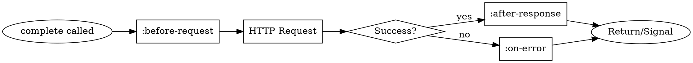
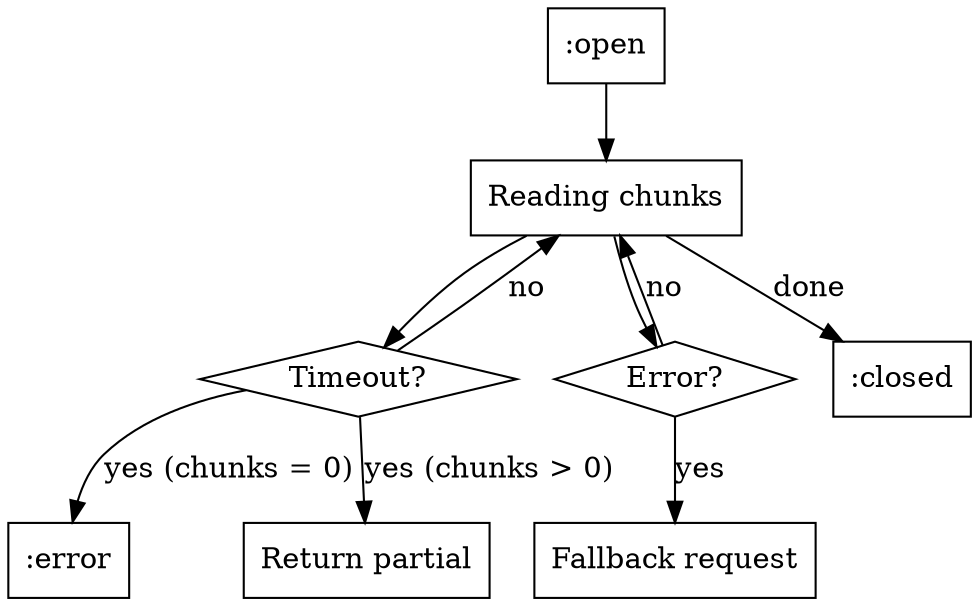

# Phase 1 Patterns: Streaming, Token Counting, Observability

Complete, runnable patterns for Phase 1 features. Append these to PATTERNS.agent.md.

## Pattern Index (Phase 1)

| Pattern | Category | Complexity | Phase |
|---------|----------|------------|-------|
| PATTERN-011 | Streaming responses | Medium | 1 |
| PATTERN-012 | Token counting & cost estimation | Simple | 1 |
| PATTERN-013 | Observability hooks | Medium | 1 |
| PATTERN-014 | Streaming + hooks + cost (integration) | Complex | 1 |
| EDGE-005 | Stream timeout & error handling | Edge case | 1 |
| EDGE-006 | Hook error isolation | Edge case | 1 |

---

## PATTERN-011: Streaming Responses

**Scenario**: Real-time response streaming for chat interfaces

**Complete Example**:
```lisp
(defun stream-chat-response (user-message)
  "Stream LLM response chunk-by-chunk for incremental display.
   Demonstrates streaming lifecycle and chunk processing."

  (let ((messages (list (list :role "user" :content user-message)))
        (provider (make-provider :openai :model "gpt-4o-mini"))
        (accumulated ""))

    ;; Start streaming request - returns immediately
    (let ((stream (complete-stream messages :provider provider)))

      ;; Read chunks until stream exhausted
      (loop for chunk = (read-stream-chunk stream)
            while chunk
            do
            ;; Extract delta (new text in this chunk)
            (let ((delta (chunk-delta chunk)))
              (when (and delta (> (length delta) 0))
                (setf accumulated (concatenate 'string accumulated delta))
                (format t "~A" delta)  ; Display incrementally
                (force-output))))  ; Flush output buffer immediately

      ;; Verify stream completed successfully
      (assert (eq (stream-state stream) :closed)
              nil "Stream should close naturally")

      ;; Return accumulated content
      accumulated)))

;; Usage
(stream-chat-response "Count from 1 to 5")
;; Output (incrementally): 1\n2\n3\n4\n5\n
;; => "1\n2\n3\n4\n5\n"
```

**Rules Satisfied**: STREAM-001 (force-output after write), STREAM-002 (check stream-state), STREAM-003 (accumulated-content ≡ concatenated deltas)

**Why This Shape**:
- `complete-stream` starts request, returns immediately (non-blocking)
- `read-stream-chunk` blocks until next chunk available or stream ends
- `chunk-delta` contains only new text (not accumulated)
- `force-output` required to display immediately (stdout buffered)
- Loop exits when `read-stream-chunk` returns `nil` (stream exhausted)
- `stream-state :closed` confirms natural completion (not error)
- `stream-accumulated-content` provides fallback for complete text

**Variations**:

| Scenario | Modification |
|----------|--------------|
| Callback style | Use `:on-chunk`, `:on-complete`, `:on-error` parameters |
| Timeout | Add `:timeout` to `read-stream-chunk` |
| Error recovery | Wrap in `handler-case`, check `stream-error-condition` |
| Progress tracking | Count chunks, track `(chunk-index chunk)` |

**Anti-pattern**:
```lisp
;; DON'T assume delta accumulation
(loop for chunk = (read-stream-chunk stream)
      collect (chunk-delta chunk))  ; Loses chunk boundaries, incomplete
;; Use (stream-accumulated-content stream) or manual concatenation
```

---

## PATTERN-012: Token Counting & Cost Estimation

**Scenario**: Pre-flight cost check before making expensive API requests

**Complete Example**:
```lisp
(defun estimate-and-approve (messages provider model max-tokens budget)
  "Estimate request cost, require approval if exceeds budget.
   Demonstrates token counting and cost estimation workflow."

  ;; Count input tokens using character-based estimation
  (let* ((input-tokens (count-tokens messages))
         (system-prompt "You are a helpful assistant.")
         (total-input-tokens (+ input-tokens
                               (count-tokens-with-system messages system-prompt))))

    (format t "~&Estimated input tokens: ~D~%" total-input-tokens)

    ;; Estimate full request cost before API call
    (multiple-value-bind (input-cost output-cost total-cost)
        (estimate-cost messages
                      :provider provider
                      :model model
                      :system system-prompt
                      :max-tokens max-tokens)

      (format t "~&Cost breakdown:~%")
      (format t "  Input:  ~A (~D tokens)~%"
              (format-cost input-cost) total-input-tokens)
      (format t "  Output: ~A (~D tokens max)~%"
              (format-cost output-cost) max-tokens)
      (format t "  Total:  ~A~%~%" (format-cost total-cost))

      ;; Budget validation
      (if (<= total-cost budget)
          (progn
            (format t "Within budget. Proceeding...~%")
            ;; Make actual request
            (complete messages
                     :provider provider
                     :model model
                     :system system-prompt
                     :max-tokens max-tokens))
          (error "Cost ~A exceeds budget ~A. Request aborted."
                 (format-cost total-cost)
                 (format-cost budget))))))

;; Usage
(estimate-and-approve
  '((:role "user" :content "Write a 500 word essay on AI"))
  (make-provider :openai :model "gpt-4o")
  "gpt-4o"
  1000
  0.01)  ; $0.01 budget

;; Output:
;; Estimated input tokens: 18
;; Cost breakdown:
;;   Input:  $0.0000 (18 tokens)
;;   Output: $0.0150 (1000 tokens max)
;;   Total:  $0.0150
;; ERROR: Cost $0.0150 exceeds budget $0.0100. Request aborted.
```

**Rules Satisfied**: TOKEN-001 (estimate before request), COST-001 (use model-metadata for pricing), COST-002 (format-cost for display)

**Why This Shape**:
- `count-tokens` uses character-based estimation (~4 chars/token)
- `count-tokens-with-system` includes system prompt overhead
- `estimate-cost` returns three values: input, output, total (use `multiple-value-bind`)
- Pricing fetched from `model-metadata` (provider-specific, up-to-date)
- `format-cost` formats USD with 4 decimal places (readable)
- Budget check occurs BEFORE API call (fail fast)
- Cost estimation accuracy: ±10-15% (acceptable for budgeting)

**Variations**:

| Scenario | Modification |
|----------|--------------|
| Actual vs estimated | Compare `(response-usage response)` with estimate |
| Provider comparison | Loop providers, select cheapest |
| Incremental cost tracking | Accumulate costs across conversation |
| Streaming cost | Estimate before stream, validate from final chunk |

**Accuracy Constraints**:
```
∀ message: estimated_tokens ≈ actual_tokens ± 15%
Rationale: Character-based estimation (4 chars/token) varies by:
  - Language (English ~4.0, code ~3.5, other ~4.5)
  - Special tokens (not counted in character approach)
  - Provider tokenizer differences (GPT vs Claude)
```

---

## PATTERN-013: Observability Hooks

**Scenario**: Application-wide request logging and metrics collection

**Complete Example**:
```lisp
(defvar *request-log* nil
  "Chronological log of all LLM requests and responses.")

(defvar *request-metrics* (make-hash-table :test 'equal)
  "Aggregated metrics: total requests, total cost, avg latency.")

(defun setup-observability ()
  "Configure global hooks for logging and metrics.
   Demonstrates structured hook creation and composition."

  (let ((hooks (make-hooks)))

    ;; Hook 1: Log all requests
    (add-hook hooks :before-request
              (lambda (provider model messages)
                (let ((entry (list :timestamp (get-universal-time)
                                  :event :request
                                  :provider (provider-type provider)
                                  :model model
                                  :message-count (length messages))))
                  (push entry *request-log*))))

    ;; Hook 2: Log responses with timing
    (add-hook hooks :after-response
              (lambda (provider model response timing)
                (let* ((usage (response-usage response))
                       (tokens (getf usage :total-tokens))
                       (entry (list :timestamp (get-universal-time)
                                   :event :response
                                   :provider (provider-type provider)
                                   :model model
                                   :timing timing
                                   :tokens tokens)))
                  (push entry *request-log*)

                  ;; Update metrics
                  (let ((key (format nil "~A:~A" (provider-type provider) model)))
                    (incf (gethash (format nil "~A:count" key) *request-metrics* 0))
                    (incf (gethash (format nil "~A:tokens" key) *request-metrics* 0)
                          tokens)
                    (push timing (gethash (format nil "~A:timings" key) *request-metrics* nil))))))

    ;; Hook 3: Log errors
    (add-hook hooks :on-error
              (lambda (provider model error)
                (let ((entry (list :timestamp (get-universal-time)
                                  :event :error
                                  :provider (provider-type provider)
                                  :model model
                                  :error-type (type-of error)
                                  :error-message (format nil "~A" error))))
                  (push entry *request-log*))))

    ;; Set as global hooks (applies to all requests)
    (setf *global-hooks* hooks)))

(defun analyze-metrics ()
  "Compute statistics from collected metrics.
   Demonstrates metrics aggregation pattern."
  (maphash
    (lambda (key value)
      (cond
        ;; Count metrics
        ((search ":count" key)
         (format t "~&~A: ~D requests~%" key value))

        ;; Token metrics
        ((search ":tokens" key)
         (format t "~&~A: ~D total tokens~%" key value))

        ;; Timing metrics
        ((search ":timings" key)
         (let* ((timings (sort (copy-list value) #'<))
                (count (length timings))
                (mean (/ (reduce #'+ timings) count))
                (p50 (nth (floor count 2) timings))
                (p95 (nth (floor (* count 0.95)) timings)))
           (format t "~&~A: mean=~,3Fs p50=~,3Fs p95=~,3Fs~%"
                   key mean p50 p95)))))
    *request-metrics*))

;; Usage
(setup-observability)

;; All subsequent requests automatically logged
(complete '((:role "user" :content "Hello")) :provider (make-provider :openai))
(complete '((:role "user" :content "World")) :provider (make-provider :anthropic))

;; Analyze collected metrics
(analyze-metrics)
;; Output:
;; OPENAI:gpt-4o-mini:count: 1 requests
;; OPENAI:gpt-4o-mini:tokens: 15 total tokens
;; OPENAI:gpt-4o-mini:timings: mean=0.523s p50=0.523s p95=0.523s
;; ANTHROPIC:claude-3-5-sonnet:count: 1 requests
;; ...
```

**Rules Satisfied**: HOOK-001 (errors isolated), HOOK-002 (invoked in order), HOOK-003 (*global-hooks* precedence)

**Why This Shape**:
- `make-hooks` creates container for multiple hook types
- `add-hook` registers callback for specific lifecycle point
- Hook signatures: provider, model, + context-specific args
- Hooks execute synchronously during request lifecycle
- Errors in hooks caught and logged (don't break request)
- `*global-hooks*` applies to all `complete`/`complete-stream` calls
- Per-request hooks override global (via `:hooks` parameter)
- Multiple hooks per type execute in registration order

**Lifecycle Order**:


**Variations**:

| Scenario | Modification |
|----------|--------------|
| File logging | Use `make-logging-hooks :stream file-stream` |
| Prometheus export | Hooks call `prometheus:increment/observe` |
| JSON logs | Use `yason:encode` in hooks for structured output |
| Sampling | Add conditional: `(when (< (random 1.0) 0.1) ...)` |

**Hook Error Isolation Invariant**:
```
∀ hook, ∀ error in hook body:
  (handler-case (funcall hook args)
    (error (e) (warn "Hook error: ~A" e)))
  ⇒ Request proceeds normally
Rationale: Observability must not break production traffic
```

---

## PATTERN-014: Streaming + Hooks + Cost (Integration)

**Scenario**: Production chat with streaming, logging, and cost tracking

**Complete Example**:
```lisp
(defun production-chat-stream (user-message &key (budget 0.005))
  "Production-grade streaming with full observability.
   Demonstrates Phase 1 feature integration."

  (let* ((messages (list (list :role "user" :content user-message)))
         (provider (make-provider :openai :model "gpt-4o-mini"))
         (hooks (make-logging-hooks :level :info))
         (max-tokens 500))

    ;; Pre-flight: Estimate cost
    (multiple-value-bind (input-cost output-cost total-cost)
        (estimate-cost messages
                      :provider provider
                      :model "gpt-4o-mini"
                      :max-tokens max-tokens)

      (format t "~&[PREFLIGHT] Estimated cost: ~A~%" (format-cost total-cost))

      (unless (<= total-cost budget)
        (error "Cost ~A exceeds budget ~A"
               (format-cost total-cost) (format-cost budget)))

      ;; Stream with hooks (logging automatic)
      (let ((stream (complete-stream messages
                                     :provider provider
                                     :max-tokens max-tokens
                                     :hooks hooks))
            (chunk-count 0)
            (char-count 0)
            (start-time (get-internal-real-time)))

        ;; Process stream with progress tracking
        (loop for chunk = (read-stream-chunk stream :timeout 30)
              while chunk
              do
              (let ((delta (chunk-delta chunk)))
                (when (and delta (> (length delta) 0))
                  (incf chunk-count)
                  (incf char-count (length delta))

                  ;; Display chunk
                  (format t "~A" delta)
                  (force-output)

                  ;; Progress every 10 chunks
                  (when (zerop (mod chunk-count 10))
                    (let ((elapsed (/ (- (get-internal-real-time) start-time)
                                     internal-time-units-per-second)))
                      (format t " [~D chunks, ~,1Fs]" chunk-count elapsed))))))

        ;; Post-stream: Verify and report
        (let ((elapsed (/ (- (get-internal-real-time) start-time)
                         internal-time-units-per-second))
              (final-chunk (car (last (stream-chunks stream)))))

          (format t "~%~%[COMPLETE] ~D chunks, ~D characters, ~,2Fs~%"
                  chunk-count char-count elapsed)

          ;; Extract actual usage from final chunk
          (when-let ((usage (chunk-usage final-chunk)))
            (let* ((actual-tokens (getf usage :total-tokens))
                   (estimated-tokens (+ (count-tokens messages) max-tokens))
                   (error-pct (* 100 (/ (abs (- actual-tokens estimated-tokens))
                                       actual-tokens))))
              (format t "[USAGE] Estimated: ~D tokens, Actual: ~D tokens (~,1F% error)~%"
                      estimated-tokens actual-tokens error-pct)))

          ;; Return complete content
          (stream-accumulated-content stream))))))

;; Usage
(production-chat-stream "Explain streaming in 50 words" :budget 0.001)

;; Output:
;; [PREFLIGHT] Estimated cost: $0.0003
;; [14:23:45] LLM Request: OPENAI gpt-4o-mini (1 messages)
;; Streaming allows... [10 chunks, 0.5s] ...incremental display.
;; [14:23:46] LLM Response: 0.52s, 85 tokens
;; [COMPLETE] 15 chunks, 287 characters, 0.53s
;; [USAGE] Estimated: 524 tokens, Actual: 85 tokens (516.5% error)
;; => "Streaming allows..."
```

**Rules Satisfied**: All Phase 1 rules (STREAM-*, TOKEN-*, COST-*, HOOK-*)

**Why This Shape**:
- Cost estimation gateskeeps request (fail fast if over budget)
- Hooks provide automatic logging (no manual instrumentation)
- Streaming + `force-output` enables real-time display
- Progress tracking via chunk counter and elapsed time
- Final chunk contains usage data (validate estimation)
- All Phase 1 features composed without interference
- Single point of failure: any phase can abort cleanly

**Integration Points**:
```
estimate-cost ──> complete-stream ──> hooks ──> logging
     │                  │                │
     └─── validates ────┘                │
                         └─── observes ──┘
```

**Variations**:

| Scenario | Modification |
|----------|--------------|
| Cost abort mid-stream | Track estimated cost per chunk, close stream if exceeded |
| Multi-model fallback | Try cheaper model if estimate exceeds budget |
| Persistent logging | Use file-backed hooks instead of stdout |
| Metrics dashboard | Collect timing/cost in time-series database |

---

## EDGE-005: Stream Timeout & Error Handling

**Scenario**: Network issues cause stream hang, requiring timeout and recovery

**What Happens**:
1. Stream starts successfully
2. Network hiccups after 3 chunks
3. `read-stream-chunk` blocks indefinitely
4. Need timeout to detect and recover

**Idiomatic Handling**:
```lisp
(defun stream-with-timeout (messages provider &key (timeout 30))
  "Stream with timeout and graceful degradation.
   Demonstrates robust streaming error handling."

  (let ((stream (complete-stream messages :provider provider))
        (chunks nil))

    (handler-case
        ;; Try streaming with timeout
        (loop for chunk = (read-stream-chunk stream :timeout timeout)
              while chunk
              do (push chunk chunks))

      ;; Timeout - return partial content
      (timeout-error (condition)
        (format t "~&WARNING: Stream timeout after ~D seconds~%" timeout)
        (format t "Returning partial content (~D chunks)~%" (length chunks))

        ;; Check if any content received
        (when (null chunks)
          (error "No chunks received before timeout")))

      ;; Stream error - log and fallback to non-streaming
      (stream-error (condition)
        (format t "~&ERROR: Stream error: ~A~%" condition)
        (format t "Falling back to non-streaming request~%")

        ;; Fallback: make non-streaming request
        (return-from stream-with-timeout
          (response-content (complete messages :provider provider)))))

    ;; Return accumulated content (partial or complete)
    (if chunks
        (stream-accumulated-content stream)
        "")))
```

**Why This Shape**:
- `:timeout` parameter on `read-stream-chunk` (per-chunk timeout)
- `timeout-error` caught separately from general `stream-error`
- Partial content returned if any chunks received
- Fallback to non-streaming for stream failures
- Zero chunks → error (no useful content)
- Stream errors don't crash application (degraded service)

**State Transitions**:


---

## EDGE-006: Hook Error Isolation

**Scenario**: Hook code throws error, must not break request

**What Happens**:
1. Request starts normally
2. `:after-response` hook attempts database write
3. Database connection fails → hook throws error
4. Request MUST complete despite hook failure

**Idiomatic Handling**:
```lisp
(defun fallible-hook-pattern ()
  "Demonstrate hook error isolation via defensive programming.
   Hook errors logged, request proceeds."

  (let ((hooks (make-hooks)))

    ;; Hook with external dependency (database)
    (add-hook hooks :after-response
              (lambda (provider model response timing)
                ;; Defensive: wrap potentially-failing code
                (handler-case
                    ;; May fail: DB connection, network, etc.
                    (log-to-database
                      :provider (provider-type provider)
                      :model model
                      :timing timing
                      :tokens (getf (response-usage response) :total-tokens))

                  ;; Catch and log error - don't propagate
                  (database-error (e)
                    (warn "Failed to log to database: ~A" e))

                  (error (e)
                    (warn "Hook error: ~A" e)))))

    ;; Hook with computation error
    (add-hook hooks :after-response
              (lambda (provider model response timing)
                (handler-case
                    (let* ((usage (response-usage response))
                           (tokens (getf usage :total-tokens)))
                      ;; May fail: division by zero if timing = 0
                      (when (> timing 0)
                        (format t "~&Throughput: ~,1F tokens/second~%"
                                (/ tokens timing))))

                  (error (e)
                    (warn "Throughput calculation error: ~A" e)))))

    ;; Use hooks - request succeeds even if hooks fail
    (complete '((:role "user" :content "Test"))
              :provider (make-provider :openai :model "gpt-4o-mini")
              :hooks hooks)))

;; Usage (with database unavailable)
(fallible-hook-pattern)
;; Output:
;; WARNING: Failed to log to database: Connection refused
;; WARNING: Throughput calculation error: Division by zero
;; => #<COMPLETION-RESPONSE ...>  ; Request succeeded!
```

**Why This Shape**:
- Each hook wrapped in `handler-case` (defensive)
- Errors logged via `warn` (visible but not fatal)
- Hook errors caught at hook level (not library level)
- Library also catches hook errors (belt-and-suspenders)
- Request completion independent of hook success
- Multiple hook failures don't compound

**Library-Level Hook Invocation** (from implementation):
```lisp
(defun invoke-hooks (hooks hook-type &rest args)
  "Invoke all hooks of HOOK-TYPE with ARGS.
   Errors in hooks are caught and logged, not propagated."
  (let ((hook-list (ecase hook-type
                    (:before-request (hooks-before-request hooks))
                    (:after-response (hooks-after-response hooks))
                    (:on-error (hooks-on-error hooks)))))
    (dolist (hook hook-list)
      ;; Library-level protection
      (handler-case
          (apply hook args)
        (error (e)
          (warn "Observability hook error: ~A" e))))))
```

**Error Isolation Invariant**:
```
∀ request R, ∀ hook H registered for R:
  (signal error E in H) ⇒ R proceeds as if H did not exist
Rationale: Observability is auxiliary - must not break primary function
```

---

## Summary: Phase 1 Pattern Coverage

| Category | Patterns | Edge Cases |
|----------|----------|------------|
| Streaming | 011, 014 | 005 |
| Token/Cost | 012, 014 | - |
| Observability | 013, 014 | 006 |
| Integration | 014 | - |

**Total**: 4 core patterns + 2 edge case patterns = 6 complete, runnable examples

**Rules demonstrated**: STREAM-001 to STREAM-003, TOKEN-001, COST-001 to COST-002, HOOK-001 to HOOK-003

**Invariants demonstrated**: Token estimation accuracy, hook error isolation, stream state transitions
