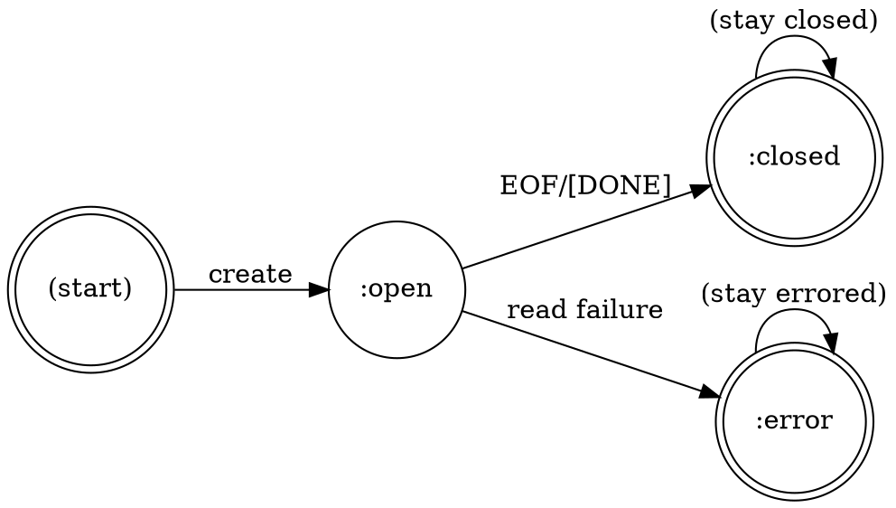

# Stream State Machine Invariants

[DRAFT] - Inferred from stream implementation

## Overview

Properties governing the lifecycle and state transitions of streaming completion responses.

---

## PROP-STREAM-001: State Enumeration

**Statement**: Stream state must be one of three values: `:open`, `:closed`, or `:error`.

**Formal Expression**:
```lisp
∀ stream ∈ CompletionStream:
  (stream-state stream) ∈ {:open, :closed, :error}
```

**Rationale**: State machine has finite states. Other values indicate corruption.

**Implementation**: `src/types.lisp:141-144`:
```lisp
(state :initarg :state
       :initform :open
       :accessor stream-state
       :documentation "Stream state: :open, :closed, :error")
```

**Violation Impact**: Stream behavior becomes undefined; predicates may fail.

---

## PROP-STREAM-002: Initial State

**Statement**: Newly created streams start in `:open` state.

**Formal Expression**:
```lisp
∀ stream ∈ CompletionStream (freshly created):
  (stream-state stream) = :open
```

**Rationale**: Streams begin ready to read. Client must detect closure via read operations.

**Implementation**: `src/types.lisp:143` - `:initform :open`

**Test Coverage**: `tests/test-streaming.lisp:31-40`

---

## PROP-STREAM-003: State Monotonicity

**Statement**: Once a stream leaves `:open` state, it never returns to `:open`.

**Formal Expression**:
```lisp
∀ stream ∈ CompletionStream:
  ∀ t1, t2 (time points where t1 < t2):
    (stream-state-at stream t1) ≠ :open ⟹
      (stream-state-at stream t2) ≠ :open
```

**Rationale**: Stream closure is irreversible. Once closed or errored, stream cannot be reopened.

**Valid Transitions**:
- `:open` → `:closed` (normal completion)
- `:open` → `:error` (read failure)
- `:closed` → `:closed` (stays closed)
- `:error` → `:error` (stays errored)

**Invalid Transitions**:
- `:closed` → `:open`
- `:error` → `:open`
- `:closed` → `:error`
- `:error` → `:closed`

**Violation Impact**: Stream semantics break; clients cannot rely on closure being final.

---

## PROP-STREAM-004: Open Predicate Equivalence

**Statement**: `stream-open-p` returns true iff state is `:open`.

**Formal Expression**:
```lisp
∀ stream ∈ CompletionStream:
  (stream-open-p stream) ⟺ (eq (stream-state stream) :open)
```

**Implementation**: `src/types.lisp:170-172`:
```lisp
(defun stream-open-p (stream)
  "Return T if STREAM is still open and receiving chunks."
  (eq (stream-state stream) :open))
```

**Rationale**: Predicate provides semantic query for readability state.

**Test Coverage**: `tests/test-streaming.lisp:31-40`

---

## PROP-STREAM-005: Closed Predicate Equivalence

**Statement**: `stream-closed-p` returns true iff state is not `:open`.

**Formal Expression**:
```lisp
∀ stream ∈ CompletionStream:
  (stream-closed-p stream) ⟺ (stream-state stream) ≠ :open
```

**Implementation**: `src/types.lisp:174-176`:
```lisp
(defun stream-closed-p (stream)
  "Return T if STREAM is closed (completed or errored)."
  (not (stream-open-p stream)))
```

**Rationale**: Closed means "not open" - both `:closed` and `:error` count as closed.

**Corollary**:
```lisp
∀ stream: (stream-open-p stream) = ¬(stream-closed-p stream)
```

---

## PROP-STREAM-006: Reading Closed Stream Returns Nil

**Statement**: Reading from a closed stream returns `nil`.

**Formal Expression**:
```lisp
∀ stream ∈ CompletionStream:
  (stream-closed-p stream) ⟹ (read-stream-chunk stream) = nil
```

**Rationale**: Clients detect stream end by receiving `nil`. Consistent with EOF semantics.

**Implementation**: Implied by protocol, enforced by provider implementations.

**Test Coverage**: Inferred from streaming protocol tests.

---

## PROP-STREAM-007: Chunk Accumulation Order

**Statement**: Stream chunks are accumulated in arrival order.

**Formal Expression**:
```lisp
∀ stream ∈ CompletionStream:
  (stream-chunks stream) = [chunk_n, chunk_(n-1), ..., chunk_1]
  where chunks are pushed to front and then nreversed for sequential access
```

**Rationale**: Chunks must be processable in arrival order for content reconstruction.

**Implementation**: Chunks pushed to front during reading, accessed in reverse order.

**Test Coverage**: `tests/test-streaming.lisp` - chunk parsing tests

---

## PROP-STREAM-008: Accumulated Content Consistency

**Statement**: Stream accumulated content equals concatenation of all chunk deltas.

**Formal Expression**:
```lisp
∀ stream ∈ CompletionStream:
  (stream-accumulated-content stream) =
    concatenate(map(chunk-delta, reverse(stream-chunks stream)))
```

**Rationale**: Content reconstruction must be deterministic and complete.

**Implementation**: Each chunk's delta is appended to accumulated content.

**Violation Impact**: Content reconstruction fails; clients see incomplete responses.

---

## PROP-STREAM-009: Chunk Index Sequencing

**Statement**: Chunk indices are sequential non-negative integers starting from 0.

**Formal Expression**:
```lisp
∀ stream ∈ CompletionStream:
  let chunks = reverse(stream-chunks stream)
  ∀ i ∈ [0, length(chunks)):
    (chunk-index chunks[i]) = i
```

**Rationale**: Indices allow clients to detect missing chunks and verify ordering.

**Implementation**: Index incremented for each parsed chunk.

**Test Coverage**: `tests/test-streaming.lisp` - chunk structure tests

---

## PROP-STREAM-010: Finish Reason Finality

**Statement**: Only the final chunk has a non-nil finish reason.

**Formal Expression**:
```lisp
∀ stream ∈ CompletionStream:
  let chunks = (stream-chunks stream)
  ∀ i < (length chunks) - 1:
    (chunk-finish-reason chunks[i]) = nil
  ∧
  (chunk-finish-reason (first chunks)) ∈ {:stop, :length, :tool-calls, nil}
```

**Rationale**: Finish reason signals completion. Only last chunk should have it.

**Implementation**: Set by `parse-stream-chunk` on detecting completion signal.

**Violation Impact**: Clients may prematurely stop reading or miss final content.

---

## State Transition Diagram



**Legend**:
- Double circle = terminal state
- Single circle = active state
- Edge label = transition trigger

---

## Test Evidence Summary

| Property | Test File | Test Name | Status |
|----------|-----------|-----------|--------|
| PROP-STREAM-001 | test-streaming.lisp:31 | stream-object-creation | ✅ |
| PROP-STREAM-002 | test-streaming.lisp:31 | stream-object-creation | ✅ |
| PROP-STREAM-004 | test-streaming.lisp:31 | stream-object-creation | ✅ |
| PROP-STREAM-005 | test-streaming.lisp:31 | stream-object-creation | ✅ |
| PROP-STREAM-008 | test-streaming.lisp | chunk parsing tests | ✅ |
| PROP-STREAM-010 | test-streaming.lisp | finish-reason tests | ✅ |

---

## Related Properties

- [Chunk Semantics](./chunk-semantics.md) - Chunk content and structure
- [Streaming Protocol](../providers/properties/streaming-protocol.md) - Provider streaming contract
